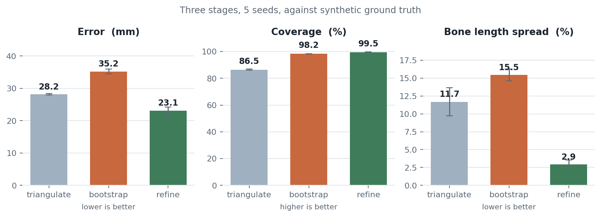

<div align="center">

# TwinPose: 3D human pose from two unsynchronized phones

Yuhyeon Lee · 2025-2026

[](https://github.com/blueion0612/TwinPose/actions/workflows/tests.yml)
[](LICENSE)
[](https://www.python.org/)
[](#limitations)

[**Recording guide**](docs/recording.md) · [**Change history**](docs/history.md) · [**Benchmark output**](validation/benchmark_results.json)

<picture>
  <source media="(prefers-color-scheme: dark)" srcset="docs/figures/hero_stages-dark.png">
  
</picture>

</div>

*Three stages against synthetic ground truth, five noise seeds. Read straight from
`validation/benchmark_results.json`, so the figure cannot drift from the table
below, which `tests/test_readme_numbers.py` checks against the same file.
Regenerate with `python docs/figures/make_hero.py`.*

**TwinPose** reconstructs 3D human motion from two ordinary phone cameras.
No synchronization hardware and no motion-capture suit: a green flashlight provides
the timing signal, a printed checkerboard provides the geometry, and one person can
record it alone.

Four things came out of the v2.0 rebuild. Six sequential heuristic correction passes
were replaced by a single windowed spatio-temporal bundle adjustment, reaching
23.1 mm MPJPE and 19.7 mm PA-MPJPE against known ground truth. A synthetic
validation framework makes accuracy measurable with no footage at all. A calibration
path was corrected for an OpenCV 5.x behavior that silently discards distortion
coefficients, taking baseline error from 12.1% to 0.14%. And a measured error budget
shows that calibration scale, not reconstruction, dominates absolute accuracy.

## Results

**No footage ships with this repository.** Videos, model weights and keypoints
are all excluded by `.gitignore`, so the pipeline cannot be re-run on the original
recordings and the numbers older versions of this README quoted cannot be
reproduced. They also disagreed with each other: 9.66 px in one section, 9.19 px
in another, and 20.35 px in the committed `evaluation_metrics.json`, for the same task
same trial.

The benchmark replaces that with something reproducible. It builds a scripted
motion by forward kinematics (so bone lengths are exact by construction),
projects it through the **real** calibrated cameras from `project/task30`,
corrupts the projections with a detector noise model, and runs the real pipeline.
Ground truth is known, so it reports true accuracy rather than self-consistency.

```bash
python main.py benchmark --seeds 5 --ablation
```

Motion: T-pose → slow squat → four walking steps → raise an arm. Detector model:
2.5 px jitter (4.5 px on the joints BODY_25B is worst at), 4% per-frame dropout,
occlusion bursts, 0.4% gross mis-detections.

### Accuracy

510 frames, 5 independent noise seeds, against the real task30 camera pair
(1.88 m baseline). `validation/benchmark_results.json` has the full output.

| Stage | MPJPE (mm) | PA-MPJPE (mm) | PCK@50 mm (%) | PCK@150 mm (%) | Bone CV (%) | Jerk RMS | Coverage (%) |
| --- | ---: | ---: | ---: | ---: | ---: | ---: | ---: |
| 1. Triangulation | 28.15 | 24.36 | 87.3 | 99.4 | 11.69 | 2599 | 86.5 |
| 2. + single-view bootstrap | 35.23 | 33.71 | 83.2 | 97.7 | 15.46 | 3412 | 98.2 |
| **3. + bundle adjustment** | **23.12** | **19.73** | **91.7** | **98.8** | **2.91** | **87** | **99.5** |
| *noise-free upper bound* | *11.92* | *5.50* | *97.2* | *100.0* | *0.51* | *13* | *100.0* |

Ground-truth jerk RMS is 98.8, so the reconstruction is now marginally smoother
than the motion itself, which is the right side of the line. Bootstrapping *costs*
accuracy on its own (28.2 → 35.2 mm) while buying 12 points of coverage; the
refinement then more than repays it. Runtime: 5.2 s for 510 frames.

Reprojection error goes *up* through the pipeline, 1.6 px → 3.4 px, and that is
correct rather than a regression. Detector noise is 2.5 px per axis, so ~3.5 px
is the true noise floor; triangulation's 1.6 px is the point being placed to
explain two noisy observations, i.e. overfitting. **Reprojection error alone
cannot tell a good reconstruction from an overfitted one**, which is why the old
README's reliance on it was misleading.

Whole-frame offset was recovered exactly in all five seeds.

### What each part of the refinement is worth

| Variant | MPJPE | PA-MPJPE | bone CV | jerk RMS |
| --- | ---: | ---: | ---: | ---: |
| full | 23.12 mm | 19.73 mm | 2.91% | 87 |
| no refinement at all | 35.46 mm | 33.99 mm | 15.62% | 3416 |
| no smoothness prior | 34.03 mm | 31.76 mm | 2.59% | 3033 |
| no bone prior | 23.12 mm | 20.20 mm | 7.47% | 83 |
| no joint limits | 23.13 mm | 19.75 mm | 2.91% | 89 |
| one pass instead of two | 23.81 mm | 20.75 mm | 4.26% | 246 |
| bone prior 15% too tall | 26.52 mm | 22.69 mm | 3.49% | 133 |

The smoothness prior does most of the work. The bone prior buys rigidity rather
than accuracy, which is what it is for. The joint-limit hinge changes nothing on
valid motion, which is also what it is for: it is insurance against impossible
poses, and this synthetic motion contains none.

That table earned its keep. An earlier version showed joint limits making
accuracy *worse* (25.4 mm with, 24.2 mm without), which turned out to be a sign
error inherited from the original code: the hinge tested `cos < 0.15`, and for a
chain (hip, knee, ankle) a straight limb gives cos ≈ −1 while a folded one
approaches +1. It was penalising straight legs during the walking stance phase.
Reversing it to bound folding instead took MPJPE from 25.4 mm to 23.1 mm.

### Sensitivity to the subject-height prior

`--subject_height` scales the bone prior before any T-pose measurement exists.
Getting it wrong is recoverable but not free (3 seeds):

| Prior | MPJPE | bone CV |
| --- | ---: | ---: |
| correct (1.72 m) | 23.12 mm | 2.91% |
| 15% too tall (1.98 m) | 26.52 mm | 3.49% |
| 15% too short (1.46 m) | 23.09 mm | 3.16% |

Overestimating hurts, underestimating barely does: too-long bones let the
single-view bootstrap place joints further out along their rays, while too-short
ones simply pull them in toward a position the reprojection term then corrects.
If you are unsure of the height, guess low.

### How to read the headline number

23 mm assumes perfect calibration and a detector whose only error is zero-mean
pixel noise. Neither holds in a real recording, and the difference is not small.
`python main.py benchmark --error-budget` measures each departure:

| Condition | MPJPE | PA-MPJPE |
| --- | ---: | ---: |
| perfect 2D, perfect calibration | 11.9 mm | 5.5 mm |
| detector noise, perfect calibration | 23.1 mm | 19.7 mm |
| rotation error 0.13° *(what this calibration achieves)* | 17.6 mm | 5.8 mm |
| rotation error 0.5° | 49.2 mm | 12.4 mm |
| rotation error 2° | 179.5 mm | 22.3 mm |
| baseline error 0.14% *(what this calibration achieves)* | 13.9 mm | 5.5 mm |
| baseline error 1% | 42.5 mm | 5.5 mm |
| baseline error 5.4% *(the old README's own figure)* | 225.4 mm | 5.5 mm |
| **realistic: measured calibration + detector noise** | **26.2 mm** | **19.5 mm** |
| realistic + 10 mm anatomical bias | 29.2 mm | 22.9 mm |
| realistic + 20 mm anatomical bias | 35.2 mm | 29.1 mm |
| realistic + 30 mm anatomical bias | 42.9 mm | 36.9 mm |

Three things follow, and they matter more than the headline:

**Calibration scale dominates absolute accuracy.** A 1% baseline error costs
more MPJPE than every other error source combined. It is also the easiest thing
to check independently: measure the distance between the two phones with a tape
and compare it against the calibrated baseline that
`calibration/calibration.py` prints. If they disagree by more than a percent,
nothing downstream is trustworthy in absolute terms.

**But scale error leaves pose *shape* intact.** PA-MPJPE aligns each frame
before measuring, so it is completely blind to baseline error: 5.5 mm whether
the baseline is 0.14% or 5.4% wrong. If the question is joint angles or movement
patterns rather than absolute distances, a scale error costs nothing. If the
question is "how far did the hand travel", it costs everything.

**The last rows are the term this benchmark cannot otherwise measure.** The
synthetic detector projects the *true* joint centers. A real 2D detector does
not: BODY_25B's "hip" is a learned annotation convention, not the anatomical hip
joint center, and the discrepancy is systematic rather than noise. For markerless
systems this is usually the largest single term when comparing against
marker-based motion capture, and no amount of reconstruction improvement removes
it. The rows show what it would cost if it were 10-30 mm.

### Calibration accuracy

A reprojection RMS is the residual of the fit that produced the numbers, so a
calibration with a 10% focal-length error drives it just as low, and every
downstream distance inherits the error. `validation/validate_calibration_synthetic.py`
renders a board through a camera whose parameters are known and reports the error
in what actually propagates.

```bash
python main.py calib-check
```

240 rendered frames per clip, task30 cameras as the truth:

| Quantity | Error |
| --- | ---: |
| focal length, camera 0 / camera 1 | 0.47% / 0.31% |
| principal point, camera 0 / camera 1 | 4.4 px / 5.5 px |
| stereo rotation | **0.13°** |
| stereo baseline (true 1877 mm) | **2.6 mm, 0.14%** |
| stereo RMS | 0.40 px |

The frame offset was chosen unambiguously: RMS 0.40 px at the correct offset
versus 46.7 px and 51.2 px on either side.

Two findings came out of building this check, and neither is visible in a
reprojection RMS:

- **Undistorting before stereo calibration is mandatory on OpenCV 5.x.** Leaving
  distortion for `stereoCalibrate` to handle put the baseline 12.1% out and the
  rotation 5.3° out, at a perfectly respectable 2.5 px RMS.
- **Board coverage decides the principal point.** Sampling board poses to tile
  the frame rather than drift near its center took principal-point error from
  27–65 px down to 2–6 px, with the reported RMS unchanged at 0.39 px throughout.

Cross-trial validation of a real calibration (an honest consistency check, not an
absolute one) is `python main.py validate --task 30 --exclude_trial 1`.

### Performance

Measured on a Ryzen 9 5900X (12 cores / 24 threads), RTX 3090 Ti, 32 GB.

| Operation | Before | After | Speedup |
| --- | --- | --- | --- |
| Sampled video read, 1080×1920 | 65 fps | 279 fps | **4.3×** |
| Checkerboard scan (8 procs × 1 cv2 thread) | 5.8 fps | 24.1 fps | **4.2×** |
| 3D reconstruction, 510 frames | not measured | 7.3 s | |

The video figure is the cost of `cap.set(CAP_PROP_POS_FRAMES)` before every read:
on H.264 with a 2-second GOP that forces a jump back to the keyframe and a
re-decode forward, so scanning a clip decodes it dozens of times over. The
previous code did this in four places, one of which seeked twice per frame to
read *consecutive* frames. Reading forward and skipping with `grab()` removes it.

Worker count matters more than "use all the cores": frame work mixes
memory-bandwidth-bound decoding with CPU-bound detection, so throughput peaks
near half the logical cores and falls off above it (24.1 fps at 8 workers, 20.1
at 22). `pose3d.video.default_workers()` encodes that.

The 3D stage is no longer worth optimizing: the old offset search evaluated 121
candidates, triangulating every frame for each, and the reconstruction ran one
`scipy.optimize.least_squares` call *per 3D point*, roughly 50,000 solver
invocations for a 30-second clip. It is now two coarse-to-fine passes and one
sparse windowed solve.

## Quick start

```bash
git clone https://github.com/blueion0612/TwinPose
cd TwinPose
conda env create -f environment.yml
conda activate pose3d
pip install -e .

# What will 2D inference actually run on? (see the GPU note below)
python main.py check

# Reproduce the accuracy figures without any footage at all
python main.py benchmark

# With your own recordings:
python main.py preview --task 30 --trial 1              # watch, pick --skip_start
python main.py run --task 30 --trial 1 --skip_start 30 --subject_height 1.72
python main.py plot --task 30 --trial 1
```

## Method

### Stages


```
stereo0/1.mp4  ─┬─► [1] synchronize ─► synchronized/*.mp4 ─► [2] calibrate ─► camera_parameters/
                └────────────────────► Estimation/cam*.mp4 ─► [3] 2D ─► 2D/*.json ─┐
mono0/1.mp4 ────────────────────────────────────────────────────────────────────────┤
                                                                                    ▼
                                                              [4] 3D ─► 3D/*.json + metrics
```

### 1. Synchronization

Green-pixel count per frame, at 1/8 resolution (a flash covers thousands of
pixels and survives the downscale). Onsets are sharp positive jumps, thresholded
robustly with median/MAD rather than mean/σ, because the flashes are themselves the
largest outliers, so a σ-based threshold hides the weaker ones.

Alignment is a vote over every pairing of one flash from each clip: the shift
that the most flashes agree on wins. A spurious detection therefore costs one
event instead of truncating the match.

### 2. Calibration

Board detection runs over contiguous frame ranges in parallel worker processes.
Views are chosen for *diversity* by a farthest-point sweep over apparent size,
image position, in-plane angle and foreshortening. A hundred near-identical
frames constrain a lens no better than one. Outlying views are dropped
iteratively using a median/MAD threshold that adapts to the run.

**Corners are undistorted before stereo calibration.** This is not cosmetic:
OpenCV 5.0's `stereoCalibrate` ignores the distortion coefficients it is given
when `CALIB_FIX_INTRINSIC` is set. Verified by passing the same coefficients
truncated to 5, 8, 12 and 14 entries and getting byte-identical results. With
distortion left in, the recovered baseline was 12% wrong; undistorting first
brings it to 0.14%.

### 3. 2D detection

Multi-scale heatmap averaging, batched across frames, with sub-pixel peak
refinement, a parabola fit to each peak's neighbors. Taking `argmax` alone
quantises every keypoint to the heatmap grid, which is upsampled from a stride-8
network and therefore coarse enough to put a floor of several pixels on the 2D
error. Hand crops are derived from the wrist/elbow/shoulder chain.

### 4. 3D reconstruction

1. **Frame offset.** Coarse whole-frame search, then a guarded sub-frame
   refinement. Scored on reprojection error restricted to fast-moving joints,
   because a stationary joint carries no timing information and the protocol
   opens with a five-second static T-pose. Fractional candidates are debiased for
   the noise that resampling removes.
2. **Triangulation.** DLT plus a vectorized Gauss-Newton polish.
3. **Single-view bootstrapping.** A joint one camera can see lies on a ray; the
   missing degree of freedom comes from the bone to its parent. Of the two
   ray-sphere intersections, the one continuing the joint's own trajectory is
   taken.
4. **Bone measurement.** T-pose frames are found by scoring vertical alignment
   against a measured up-axis, then bone lengths are trimmed-mean averaged.
   Implausible measurements fall back to a height-scaled prior.
5. **Spatio-temporal bundle adjustment.** One least-squares problem over
   overlapping temporal windows, with an analytic sparse Jacobian:

   | Residual | Meaning |
   | --- | --- |
   | reprojection | the data term, Huber-robust, confidence weighted |
   | bone length | each bone toward its personalised length |
   | acceleration | second-difference smoothness prior |
   | joint limits | one-sided hinge, active only on hyperextension |

   Weights are expressed as uncertainties (`residual / sigma`), so
   `sigma_bone_m = 0.012` reads as "a one-centimetre bone error costs about as
   much as a one-sigma reprojection error" and a single Huber `f_scale` is
   meaningful across every block.

This replaces six sequential heuristic passes: a bundle adjustment whose result
was discarded, a 20% bone-length lerp, a 10% joint-angle nudge, a 20% torso nudge,
a second discarded bundle adjustment, and a Savitzky-Golay pass followed by
subtracting 25% of each point's acceleration. Those were gradient steps on
objectives that partly disagreed, applied in a fixed order with hand-tuned step
sizes and no convergence check. See [Evaluation](#evaluation) for what the change
is worth.

### 5. Wrist kinematics

Forearm frame from elbow→wrist; hand frame from the palm plane, averaged over
four triangles so one bad MCP joint cannot tip it. Flexion/extension, radial/ulnar
deviation and pronation/supination are the y-x-z decomposition of the relative
rotation, sign-mirrored so a positive number means the same anatomical direction
on both hands. Short gaps are bridged with SLERP; the angle traces are unwrapped
before smoothing so a trace crossing ±180° is not corrupted.

## Usage

| # | Stage | Command |
| --- | --- | --- |
| 1 | Synchronize and split | `synchronize/synchronizevideo.py --stage 1\|2` |
| 2 | Calibrate | `calibration/calibration.py` |
| 3 | 2D detection | `estimation/Openpose.py` |
| 4 | 3D reconstruction | `estimation/3D_estimation.py` |
| | Visualize | `estimation/plot.py` |
| | Compare placements | `estimation/compare.py` |

`main.py` sequences them; each is also a standalone script.

Using MMPose instead of OpenPose for step 3? Point
`estimation/3D_estimation_mmpose.py` at `2D/results_cam{0,1}.json` in MMPose
prediction format. It is a thin adapter over the same pipeline, not a second
copy of it.

Recording the footage in the first place, the flash, the
board and the T-pose, is covered in [the recording guide](docs/recording.md).

## Repository layout

```
pose3d/                  the library, one implementation of everything
├── skeleton.py          keypoint schema, bone model, index remapping
├── camera.py            pinhole model, calibration IO, unit conversion
├── geometry.py          triangulation, projection, Procrustes
├── config.py            every tunable parameter, in one dataclass
├── kpio.py              keypoint JSON readers and writers
├── pipeline.py          the 3D reconstruction, stage by stage
├── refine.py            windowed spatio-temporal bundle adjustment
├── hands.py             hand reconstruction and wrist kinematics
├── metrics.py           evaluation metrics, including a vendored DTW
├── calibrate.py         intrinsics and extrinsics
├── sync.py              flash detection and alignment
├── inference.py         2D backend, device reporting, heatmap decoding
├── video.py             fast video IO and parallel frame mapping
├── adapters.py          MMPose COCO-WholeBody → this schema
├── synth.py             synthetic motion with exact ground truth
└── synth_board.py       synthetic checkerboard footage

synchronize/ calibration/ estimation/ tools/    CLI entry points, one per stage
validation/                                     benchmarks and their results
tests/                                          103 tests, two of them on this README
project/                                        recordings, calibration, results
main.py                                         sequences the stages
```

## Tests

```bash
pip install -e ".[dev]"                       # so the tests can import pose3d
python -m pytest -q                           # 103 tests, about 8 minutes
python main.py benchmark                      # accuracy against known truth
python main.py calib-check                    # calibration against known cameras
```

Two of the tests read this README and assert the Accuracy table against
`validation/benchmark_results.json`, so the numbers above cannot drift from the
benchmark without CI failing. Without the editable install, a bare `pytest`
cannot import `pose3d`; `python -m pytest` from the repository root works instead,
because that puts the root on the import path.

Tested on Python 3.10, the pinned version, 3.11 and 3.12.

## Requirements

```bash
conda env create -f environment.yml
conda activate pose3d
pip install -e .          # optional: puts `pose3d` on the path for your own code
```

2D detection needs the OpenPose BODY_25B and hand models, which are not in this
repository for size and license reasons. See
[`estimation/model/README.md`](estimation/model/README.md) for download links and
where to put them. Everything except the 2D stage runs without them, including the
full accuracy benchmark.

### A word about the GPU

`python main.py check` prints what inference will really use. On most installs
the answer is the CPU, even with a fast NVIDIA card present, because the
`opencv-contrib-python` wheel on PyPI **is built without CUDA**. Setting
`DNN_BACKEND_CUDA` on such a build does not fail. OpenCV falls back to the CPU
silently, and the only symptom is that the run takes an hour. Getting the GPU
involved requires building OpenCV from source with CUDA enabled.

## Limitations

- **A small board limits stereo accuracy, and stereo accuracy dominates absolute
  error.** The baseline is inferred from the board's apparent size; an A4 board at
  2.5 m spans about 8% of the frame. A 1% baseline error costs more MPJPE than
  all the detector noise put together (see the error budget), so a larger printed
  board is the single cheapest improvement available, and measuring the phone
  separation with a tape is a free sanity check on the result.
- **Absolute distances are only as good as the calibration; joint angles are
  much more forgiving.** Scale error is invisible to PA-MPJPE. Decide which of
  the two your question needs before trusting a number.
- **The 2D detector's anatomical convention is not measured here.** The synthetic
  detector projects true joint centers; a real one does not, and for markerless
  systems that discrepancy is usually the largest error term against marker-based
  reference. Nothing in this repository can quantify it without real
  simultaneously-recorded motion capture.
- **The checkerboard's 180° ambiguity is unresolvable.** A plain grid looks
  identical rotated half a turn, and both a homography fit and a PnP pose
  comparison are provably blind to the difference (the flip maps the board onto
  itself). Measured against known poses the two views disagree in 5–7% of frames;
  the Sampson outlier rejection drops exactly those. A ChArUco board would remove
  the ambiguity outright.
- **Sub-frame synchronization needs fast motion.** A whole-frame sync error costs
  about 3 mm of MPJPE; sub-frame precision is worth about 0.5 mm, and is only
  observable when something is moving. The search reports a confidence margin;
  a flat margin means the clip could not tell.
- **Two views leave depth the weakest axis.** Reprojection error is largely blind
  to it, so check `HipZVariance` and the bone-length CV instead.
- **No CUDA in the OpenCV wheel**, as above.
- Ground-truth metrics in `compare.py` (MPJPE against real motion capture) need a
  `gt.json` that this project has never had; the code path exists and is tested
  against synthetic ground truth.

## Citation

```bibtex
@misc{lee2026twinpose,
  author  = {Yuhyeon Lee},
  title   = {TwinPose: 3D Human Pose from Two Unsynchronized Smartphones},
  year    = {2026},
  version = {2.0.0},
  url     = {https://github.com/blueion0612/TwinPose},
  note    = {Unpublished}
}
```

## License

MIT. See [`LICENSE`](LICENSE). The OpenPose model weights are **not** included
and carry CMU's own non-commercial research license; see
[`estimation/model/README.md`](estimation/model/README.md).

